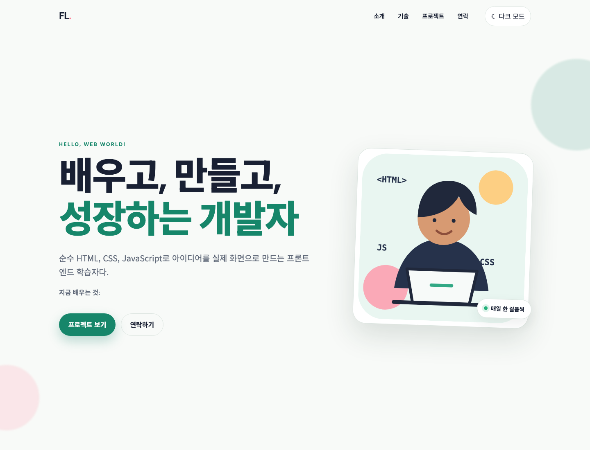
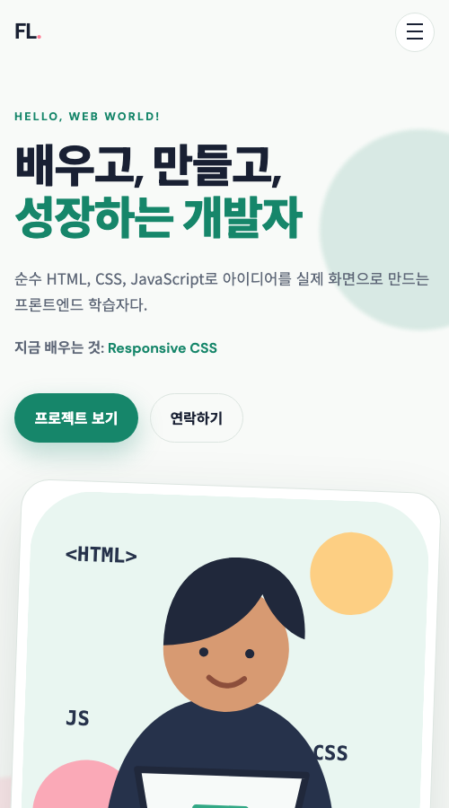
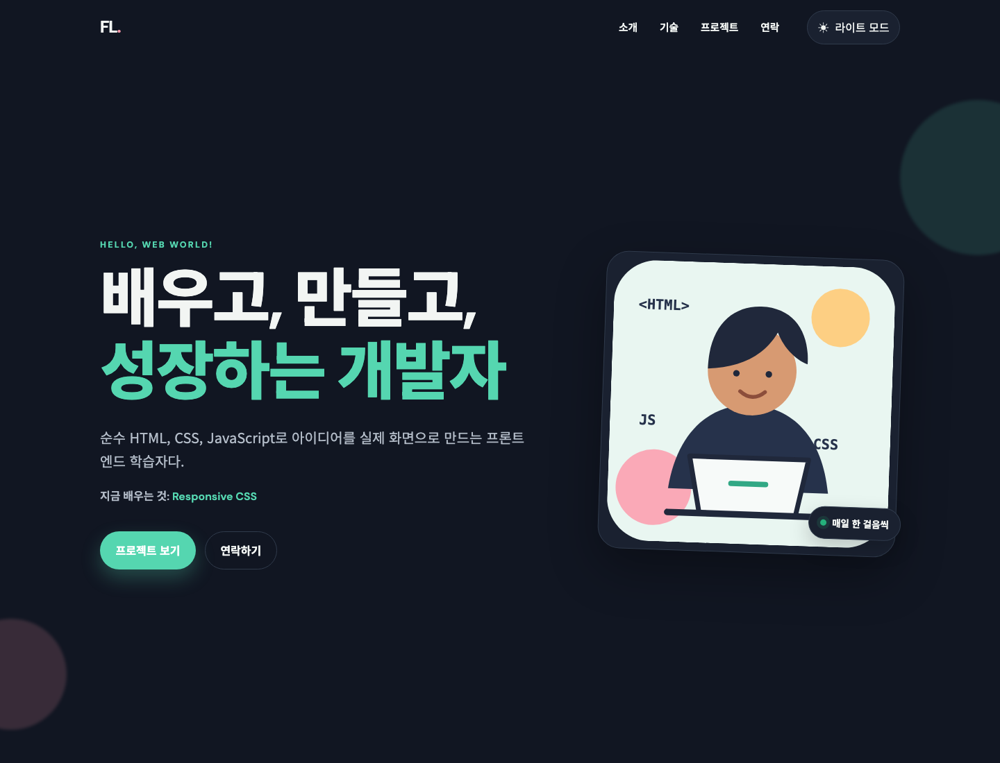

# 🟩 HTML, CSS, JavaScript - 나를 소개하는 웹페이지 처음부터 만들기  

외부 프레임워크 없이 순수 HTML, CSS, JavaScript로 만든 반응형 학습자 포트폴리오다.  

<br><br>

## 🟢 주요 기능  

- 모바일·태블릿·데스크톱 반응형 레이아웃  
- 시맨틱 HTML과 키보드 접근성  
- 햄버거 메뉴와 부드러운 섹션 이동  
- 로컬스토리지에 저장되는 다크 모드  
- 60px 스크롤 뒤 상단 메뉴 배경 변경  
- 300px 스크롤 뒤 맨 위 이동 버튼 표시  
- Intersection Observer 임계값 `0.2`의 등장 애니메이션  
- GitHub API 로딩·성공·오류·빈 상태 처리  
- GitHub 저장소 언어별 필터링  
- 이름·이메일·메시지 폼 유효성 검사  
- Hero 타이핑 효과  


<br><br>

## 🟢 프로젝트 구조  

```text
learn_frontend_origin/  
├── index.html  
├── css/  
│   ├── base.css  
│   ├── header.css  
│   ├── sections.css  
│   └── responsive.css  
├── js/  
│   ├── config.js  
│   ├── ui.js  
│   ├── form.js  
│   ├── projects.js  
│   └── app.js  
├── images/  
│   └── profile.svg  
├── tests/  
│   └── static-check.mjs  
├── docs/  
│   └── requirement.md  
├── _practice/  
└── README.md  
```

<br><br>

## 🟢 사용 기술  

| 구분 | 기술 | 역할 |  
|---|---|---|
| 구조 | HTML5 | 시맨틱 문서와 폼 |  
| 디자인 | CSS3 | 모바일 우선 반응형 화면과 테마 |  
| 동작 | JavaScript ES6+ | DOM, 이벤트, 상태, 비동기 API |  
| 데이터 | GitHub REST API | 공개 저장소 목록 |  
| 테스트 | Node.js | 문법 및 요구사항 정적 검사 |  
| 배포 | GitHub Pages | 정적 웹사이트 공개 |  


<br><br>

## 🟢 GitHub Organization 설정  

현재는 `zerodayparty` Organization의 공개 저장소를 가져온다. 다른 Organization으로 바꾸려면 [js/config.js](js/config.js)의 설정만 바꾼다.  

```javascript
window.PortfolioConfig = Object.freeze({ // 모든 기능이 함께 사용할 공개 설정을 만든다.  
    displayName: "본인 공개 이름", // 화면 하단에 표시할 공개 이름이다.  
    githubOrganization: "zerodayparty", // 공개 저장소를 불러올 GitHub Organization 이름이다.  
}); // 공개 설정을 끝내고 실수로 값이 바뀌지 않게 고정한다.  
```

사용하는 API 주소는 `https://api.github.com/orgs/zerodayparty/repos`다. 공개 저장소만 가져오므로 API Key나 GitHub Token은 필요하지 않다. 인증 없는 GitHub API는 IP 주소 기준 시간당 60회 제한이 있으므로 반복 새로고침을 피한다.  


<br><br>

## 🟢 로컬 실행  

별도 서버는 필요 없다.  

- Finder에서 `index.html`을 두 번 누른다.  
- 요구사항에 적힌 개발 방식이 필요하면 VS Code의 Live Server로 `index.html`을 연다.  

평소 확인은 `file://` 방식으로 충분하다. Live Server는 코드 수정 뒤 자동 새로고침이 필요할 때만 선택해서 사용한다.  


<br><br>

## 🟢 스크린샷  

### 🟡 데스크톱 밝은 모드  

  

### 🟡 모바일 500px  

  

### 🟡 데스크톱 다크 모드  

  

<br><br>

## 🟢 보안과 데이터 처리  

- `.env`, API Key, GitHub Token을 사용하지 않는다.  
- GitHub Organization API에서 받은 문자는 HTML 특수문자로 변환한 뒤 화면에 넣는다.  
- 외부 링크는 `https://github.com` 주소만 허용한다.  
- 문의 폼은 학습용이며 입력값을 서버에 보내거나 저장하지 않는다.  
- 외부 링크는 새 창의 원래 페이지 접근을 제한하도록 `rel="noreferrer"`를 사용한다.  

<br><br>

## 🟢 실습 문서  

`_practice` 폴더의 `20`번 문서부터 `32`번 문서까지 짝수 순서대로 진행한다.  
